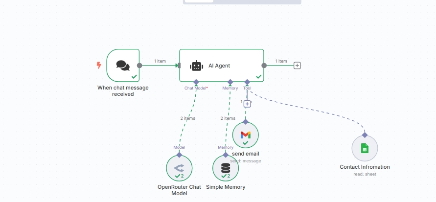

# n8n Email Agent Workflow

This workflow lets you send emails using AI in n8n. It connects to Google Sheets for contacts, uses OpenRouter for AI, and sends emails with Gmail.

## What It Does
- Chat with an AI to send emails
- Finds contacts in Google Sheets
- Remembers your chat for context
- Sends emails using Gmail

## What You Need
- n8n set up
- OpenRouter, Google Sheets, and Gmail credentials
- A Google Sheet with your contacts (ID: `1vYNiEP5_ifqE53h2rXzqJAnM_rTSNH8M36Of1nUzZRY`)

## How To Use
1. Import this workflow into n8n
2. Add your credentials
3. Make sure your Google Sheet has contact info
4. Activate the workflow
5. Send a chat message to start

The AI will handle your request, find the contact, and send the email for you.

## Help
- [n8n docs](https://docs.n8n.io)
- [OpenRouter docs](https://openrouter.ai/docs)
- [Google Sheets API](https://developers.google.com/sheets/api) 